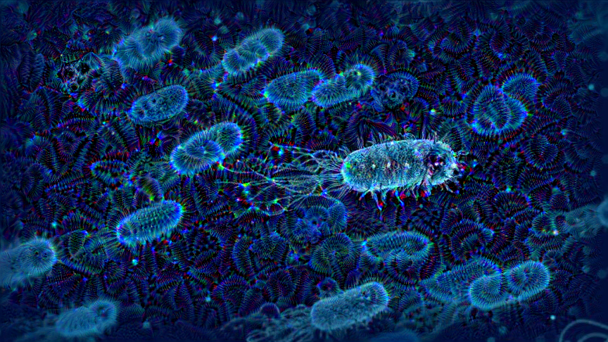

# DeepDream

DeepDream is an artistic image-modification technique that uses the representations learnd by CNN. It was firstt released by Google in the summer of 2015, as an implementation written using the Caffe framework. 

It quickly became an internet sensation thanks to the trippy pictures it could generate. DeepDream convnet was trained on ImageNet, where dog breeds and bird species are vastly overpresented.

The DeepDream algorithm is almost identical to the convnet filter-visualization technique, consisting of running a convnet in reverse: doing gradient ascent on the input to the convnet in order to maximize the activation of a spesific filter in an upper layer of the convnet.

DeepDream uses this same idea, with a few simple differences:

- With DeepDream,  you try to maximize the activation of entire layers rather than of a spesific filter, thus mixing together vis of large numbers of features at once.  
- You start not from blank, slighlty noisy input, but rather from an existing image-thus the resulting effects latch on to preexisting visual patters, distorting elements of the images in a somewhat artistic fashion.  
- The input images are processed at different scales (callede octaves), which improves the quality of the visualization.  

In Keras, many such convnets are avaliable: VGG16, VGG19, Xception, ResNet50 and so on . In this application, I used inception_v3 convnets.

If you want to more about "Inception", you should check this out this [paper](https://arxiv.org/pdf/1512.00567.pdf).  

## The DeepDream process:

The method is to process images at a list of “scales” and run gradient ascent to maximize the loss at this scale. With each successive scale, upscale the image by 40%. In order to avoid the lose of image detail when upscaling image from small to large, also inserted the lost details back by using the larger original image.

  
Successive scales of spatial processing(octaves) and detail reinjection upon upscaling.

# Quick Start Examples

## Installation

    $ git clone https://github.com/mftnakrsu/DeepDream.git  
    $ cd DeepDream  
    $ pip install -r requirements.txt  
    
## Usage 
    $ python -m main.py --image /path/to/image
                     --step /numberofstep
                     --iterations /numberofiterations
                     --max_loss /maxlose/
                     
If you want different variations, you can change the layers:

    layer_settings = {
    "mixed7": 1.5,
    "mixed8":1.5,
    "mixed5":1.0,
    }

You can check the model layers with these commands:

    print(model.summary())

## Some Results:

## References:

    https://ai.googleblog.com/2015/06/inceptionism-going-deeper-into-neural.html  
    https://arxiv.org/abs/1512.00567  
    https://www.amazon.com/Deep-Learning-Python-Francois-Chollet/dp/1617294438
